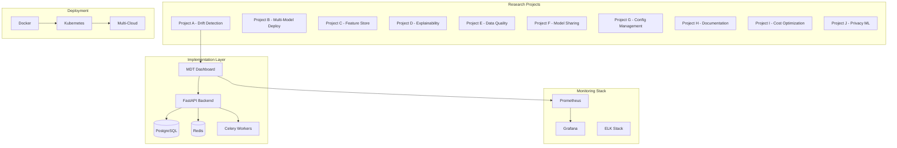

# 📚 MLOPS Projects Documentation Hub

<div align="center">


**Comprehensive documentation for the complete MLOPS ecosystem and research projects**

[🚀 Quick Start](#quick-start) • [📋 Projects](#projects-overview) • [🏗️ Architecture](#architecture) • [🛠️ Development](#development-guide)

</div>

---

## 📋 **Table of Contents**

1. [Overview](#overview)
2. [Projects Overview](#projects-overview)
3. [Architecture](#architecture)
4. [Quick Start](#quick-start)
5. [Development Guide](#development-guide)
6. [Deployment](#deployment)
7. [Tech Stack Mindmaps](#tech-stack-mindmaps)
8. [Contributing](#contributing)
9. [Support](#support)

---

## 🎯 **Overview**

This repository contains a comprehensive collection of **10 cutting-edge MLOps research projects** and a **production-ready implementation** of the Model Drift Detection & Telemetry (MDT) Dashboard. The projects address critical challenges in modern machine learning operations, from automated model monitoring to privacy-preserving ML operations.

### 🌟 **Key Highlights**

- **10 Research Projects** covering the entire MLOps lifecycle
- **1 Production Implementation** - MDT Dashboard for drift detection
- **Comprehensive Tech Stack Analysis** with Mermaid mindmaps
- **Enterprise-grade** solutions for real-world deployment
- **Multi-cloud** deployment support (AWS, GCP, Azure)
- **Industry-focused** applications across various sectors

---

## 📊 **Projects Overview**

| Project | Focus Area | Status | Implementation |
|---------|------------|--------|----------------|
| **A** | [Automated Model Performance Degradation Detection](Projects/A.md) | ✅ **Implemented** | [MDT Dashboard](Project/MDT-Dashboard/) |
| **B** | [Multi-Model Deployment Orchestration](Projects/B.md) | 📋 Research | Planned |
| **C** | [Real-Time Feature Store for Streaming Data](Projects/C.md) | 📋 Research | Planned |
| **D** | [ML Model Explainability as a Service](Projects/D.md) | 📋 Research | Planned |
| **E** | [Automated Data Quality Monitoring](Projects/E.md) | 📋 Research | Planned |
| **F** | [Cross-Organization Model Sharing Platform](Projects/F.md) | 📋 Research | Planned |
| **G** | [ML Pipeline Configuration Management](Projects/G.md) | 📋 Research | Planned |
| **H** | [Automated Model Documentation Generator](Projects/H.md) | 📋 Research | Planned |
| **I** | [ML Model Cost Optimization System](Projects/I.md) | 📋 Research | Planned |
| **J** | [Privacy-Preserving ML Operations](Projects/J.md) | 📋 Research | Planned |

### 🏆 **Featured Implementation: MDT Dashboard**

The **Model Drift Detection & Telemetry Dashboard** is our flagship implementation addressing **Project A**. It provides:

- 🔍 **Real-time drift detection** using multiple statistical algorithms
- 📊 **Comprehensive monitoring** with Prometheus/Grafana integration
- 🤖 **Automated ML pipeline** with training and retraining capabilities
- 🎨 **Interactive dashboard** built with Streamlit and Plotly
- 🏗️ **Production-ready** architecture with Docker and Kubernetes support

---

## 🏗️ **Architecture**

### 🎯 **High-Level System Design**



### 🔧 **Technology Stack**

| Layer | Technologies |
|-------|-------------|
| **Frontend** | Streamlit, Plotly, D3.js, React |
| **Backend** | FastAPI, Python, Celery, Redis |
| **Database** | PostgreSQL, MongoDB, InfluxDB |
| **ML/Data** | Scikit-learn, TensorFlow, PyTorch, Pandas |
| **Monitoring** | Prometheus, Grafana, ELK Stack |
| **Cloud** | AWS, GCP, Azure |
| **DevOps** | Docker, Kubernetes, GitLab CI/CD |
| **Security** | OAuth 2.0, JWT, Vault, RBAC |

---

## 🚀 **Quick Start**

### 📋 **Prerequisites**

- **Python 3.9+**
- **Docker & Docker Compose**
- **Git**
- **Poetry** (recommended) or pip

### ⚡ **Installation**

```bash
# 1. Clone the repository
git clone <repository-url>
cd MLOPS

# 2. Navigate to MDT Dashboard
cd Project/MDT-Dashboard

# 3. Install dependencies
pip install poetry
poetry install

# 4. Start the services
docker-compose up -d

# 5. Run the application
streamlit run src/mdt_dashboard/dashboard/main.py
```

### 🌐 **Access Points**

- **Dashboard**: http://localhost:8501
- **API Documentation**: http://localhost:8000/docs
- **Grafana**: http://localhost:3000 (admin/admin)
- **Prometheus**: http://localhost:9090

---

## 🛠️ **Development Guide**

### 📁 **Project Structure**

```
MLOPS/
├── 📁 Project/
│   └── 📁 MDT-Dashboard/           # Main implementation
│       ├── 📁 src/                 # Source code
│       ├── 📁 tests/               # Test suites
│       ├── 📁 k8s/                 # Kubernetes manifests
│       ├── 📁 docker/              # Docker configurations
│       └── 📁 docs/                # Technical documentation
├── 📁 Projects/                    # Research project descriptions
│   ├── 📄 A.md                     # Drift Detection (Implemented)
│   ├── 📄 B.md                     # Multi-Model Deploy
│   └── 📄 ...                      # Other projects
├── 📁 Mermaid/                     # Tech stack mindmaps
│   ├── 📄 A_Mermaid.md
│   └── 📄 ...
└── 📁 Documentation/               # This documentation hub
```

### 🔧 **Development Setup**

```bash
# Install development dependencies
poetry install --with dev

# Setup pre-commit hooks
pre-commit install

# Run tests
pytest tests/

# Code quality checks
black src/
isort src/
flake8 src/
mypy src/
```

### 🧪 **Testing Strategy**

| Test Type | Location | Purpose |
|-----------|----------|---------|
| **Unit** | `tests/unit/` | Component-level testing |
| **Integration** | `tests/integration/` | API and service integration |
| **E2E** | `tests/e2e/` | End-to-end system testing |
| **Performance** | `tests/performance/` | Load and stress testing |

---

## 🚀 **Deployment**

### 🐳 **Docker Deployment**

```bash
# Development
docker-compose up -d

# Production
docker-compose -f docker-compose.prod.yml up -d
```

### ☸️ **Kubernetes Deployment**

```bash
# Apply all manifests
kubectl apply -f k8s/

# Check deployment status
kubectl get pods -n mdt-dashboard
```

### ☁️ **Cloud Deployment**

#### AWS
- **ECS**: Container deployment
- **EKS**: Kubernetes orchestration
- **Lambda**: Serverless functions
- **SageMaker**: ML model hosting

#### Google Cloud
- **GKE**: Kubernetes orchestration
- **Cloud Run**: Container deployment
- **Vertex AI**: ML platform integration

#### Azure
- **AKS**: Kubernetes orchestration
- **Container Instances**: Quick deployment
- **ML Studio**: ML platform integration

---

## 🗺️ **Tech Stack Mindmaps**

Comprehensive technology analysis for each project:

- [📊 A_Mermaid.md](Mermaid/A_Mermaid.md) - Drift Detection Tech Stack
- [🚀 B_Mermaid.md](Mermaid/B_Mermaid.md) - Multi-Model Deployment
- [⚡ C_Mermaid.md](Mermaid/C_Mermaid.md) - Real-Time Feature Store
- [🔍 D_Mermaid.md](Mermaid/D_Mermaid.md) - Model Explainability
- [✅ E_Mermaid.md](Mermaid/E_Mermaid.md) - Data Quality Monitoring
- [🤝 F_Mermaid.md](Mermaid/F_Mermaid.md) - Model Sharing Platform
- [⚙️ G_Mermaid.md](Mermaid/G_Mermaid.md) - Configuration Management
- [📚 H_Mermaid.md](Mermaid/H_Mermaid.md) - Documentation Generator
- [💰 I_Mermaid.md](Mermaid/I_Mermaid.md) - Cost Optimization
- [🔒 J_Mermaid.md](Mermaid/J_Mermaid.md) - Privacy-Preserving ML

---

## 🎯 **Industry Applications**

### 🏦 **Financial Services**
- Fraud detection monitoring
- Credit risk model drift
- Algorithmic trading systems
- Regulatory compliance

### 🏥 **Healthcare**
- Diagnostic model monitoring
- Drug discovery pipelines
- Medical imaging analysis
- Clinical decision support

### 🛒 **Retail & E-commerce**
- Recommendation systems
- Demand forecasting
- Price optimization
- Customer segmentation

### 🏭 **Manufacturing**
- Predictive maintenance
- Quality control
- Supply chain optimization
- Process automation

---

## 📈 **Monitoring & Observability**

### 📊 **Key Metrics**

| Category | Metrics | Tools |
|----------|---------|-------|
| **Model** | Accuracy, Drift Score, Latency | Custom, MLflow |
| **System** | CPU, Memory, Network, Disk | Prometheus, Node Exporter |
| **Business** | Request Volume, Error Rate, SLA | Grafana, Custom Dashboards |
| **Data** | Quality Score, Freshness, Volume | Great Expectations, Custom |

### 🚨 **Alerting Strategy**

- **Threshold-based** alerts for known issues
- **Anomaly detection** for unknown patterns
- **Multi-channel** notifications (Email, Slack, PagerDuty)
- **Alert fatigue** mitigation with smart grouping

---

## 🤝 **Contributing**

We welcome contributions to all projects! Here's how you can help:

### 🔄 **Contribution Workflow**

1. **Fork** the repository
2. **Create** a feature branch (`git checkout -b feature/amazing-feature`)
3. **Commit** your changes (`git commit -m 'Add amazing feature'`)
4. **Push** to the branch (`git push origin feature/amazing-feature`)
5. **Open** a Pull Request

### 📝 **Contribution Guidelines**

- Follow **Python PEP 8** style guidelines
- Write **comprehensive tests** for new features
- Update **documentation** for any changes
- Use **conventional commits** for commit messages
- Ensure **CI/CD pipeline** passes

### 🏷️ **Issue Labels**

| Label | Description |
|-------|-------------|
| `bug` | Something isn't working |
| `enhancement` | New feature or improvement |
| `documentation` | Documentation improvements |
| `good first issue` | Good for newcomers |
| `help wanted` | Extra attention needed |

---

## 🔐 **Security**

### 🛡️ **Security Measures**

- **Authentication**: JWT-based API security
- **Authorization**: Role-based access control (RBAC)
- **Encryption**: Data at rest and in transit
- **Audit Logging**: Complete activity tracking
- **Vulnerability Scanning**: Regular security assessments

### 🚨 **Security Reporting**

For security vulnerabilities, please email: **aponduga@cisco.com**

---

## 📚 **Additional Resources**

### 📖 **Documentation**

- [🏗️ Architecture Guide](Project/MDT-Dashboard/docs/architecture.md)
- [🚀 Deployment Guide](Project/MDT-Dashboard/docs/deployment.md)
- [🔧 API Reference](Project/MDT-Dashboard/docs/api.md)
- [🛠️ Troubleshooting](Project/MDT-Dashboard/docs/troubleshooting.md)

### 🎓 **Learning Resources**

- [MLOps Best Practices](https://ml-ops.org/)
- [Model Monitoring Guide](https://neptune.ai/blog/ml-model-monitoring-best-tools)
- [Drift Detection Methods](https://towardsdatascience.com/drift-detection-methods)
- [Production ML Systems](https://madewithml.com/courses/mlops/)

### 🔗 **External Links**

- [Databricks MLOps](https://databricks.com/solutions/accelerators/mlops)
- [AWS SageMaker](https://aws.amazon.com/sagemaker/)
- [Google Vertex AI](https://cloud.google.com/vertex-ai)
- [MLflow](https://mlflow.org/)

---

## 📞 **Support**

### 💬 **Community Support**

- **GitHub Issues**: [Report bugs and request features](https://github.com/your-repo/issues)
- **Discussions**: [Community discussions](https://github.com/your-repo/discussions)
- **Stack Overflow**: Tag your questions with `mdt-dashboard`

### 📧 **Direct Support**

- **Email**: aponduga@cisco.com
- **LinkedIn**: [Ajay Kumar Pondugala](https://linkedin.com/in/ajaykumarpondugala)

### 🕐 **Response Times**

| Priority | Response Time |
|----------|---------------|
| **Critical** | Within 2 hours |
| **High** | Within 8 hours |
| **Medium** | Within 24 hours |
| **Low** | Within 72 hours |

---

## 📄 **License**

This project is licensed under the **MIT License** - see the [LICENSE](LICENSE) file for details.

---

## 🏆 **Acknowledgments**

### 👥 **Contributors**

- **Ajay Kumar Pondugala** - Project Lead & Principal Developer
- **Open Source Community** - Various contributions and feedback

### 🎯 **Inspiration**

- **Industry Leaders**: Databricks, Amazon SageMaker, Google Vertex AI
- **Open Source Projects**: MLflow, Evidently, Great Expectations
- **Research Papers**: Latest MLOps and model monitoring research

### 🌟 **Special Thanks**

- **Cisco Systems** - Supporting innovation in ML operations
- **Open Source Community** - Continuous feedback and contributions
- **Early Adopters** - Testing and validation in production environments

---

<div align="center">

## 🚀 **Ready to Get Started?**

[📚 Read the Docs](Project/MDT-Dashboard/README.md) • [🔧 View API](http://localhost:8000/docs) • [💬 Join Discussion](https://github.com/your-repo/discussions)

---

**Built with ❤️ by [Ajay Kumar Pondugala](mailto:aponduga@cisco.com)**

*Empowering ML teams with production-ready monitoring, drift detection, and comprehensive MLOps solutions*


</div>
