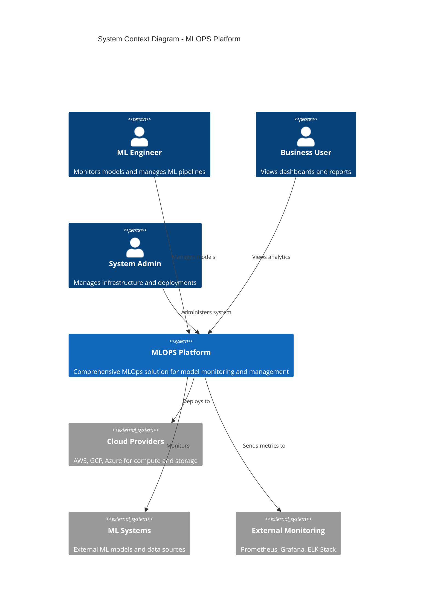
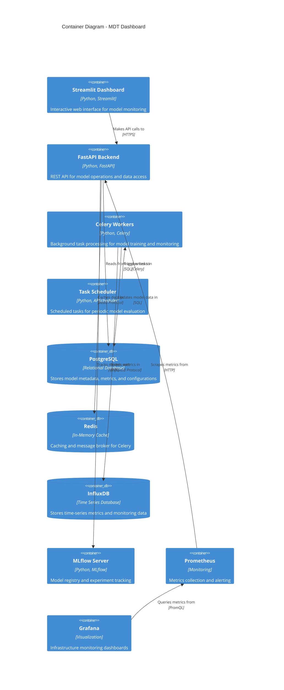
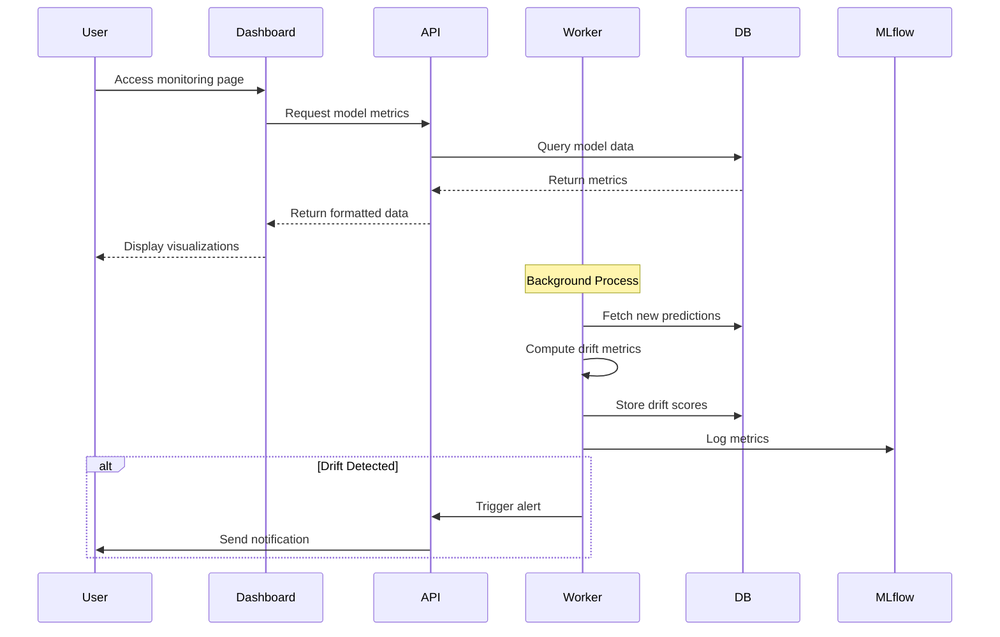
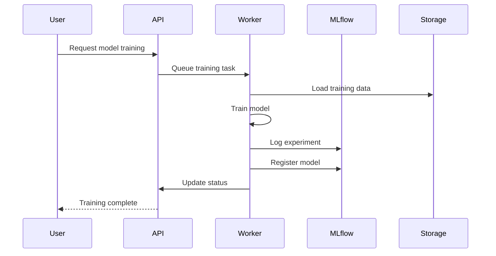
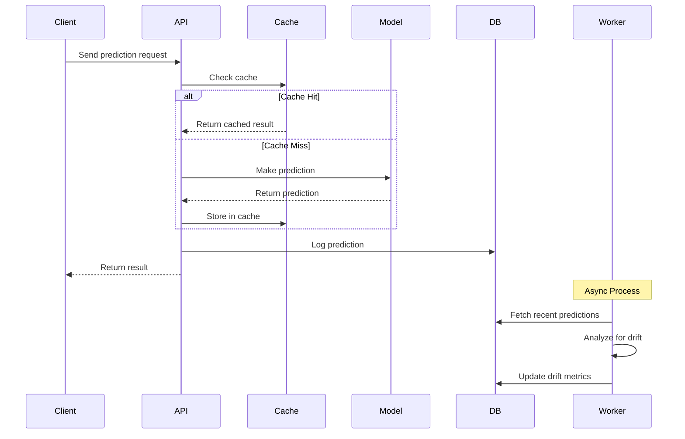
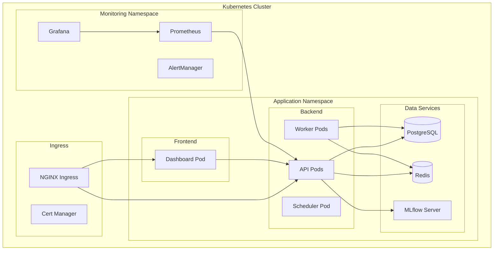
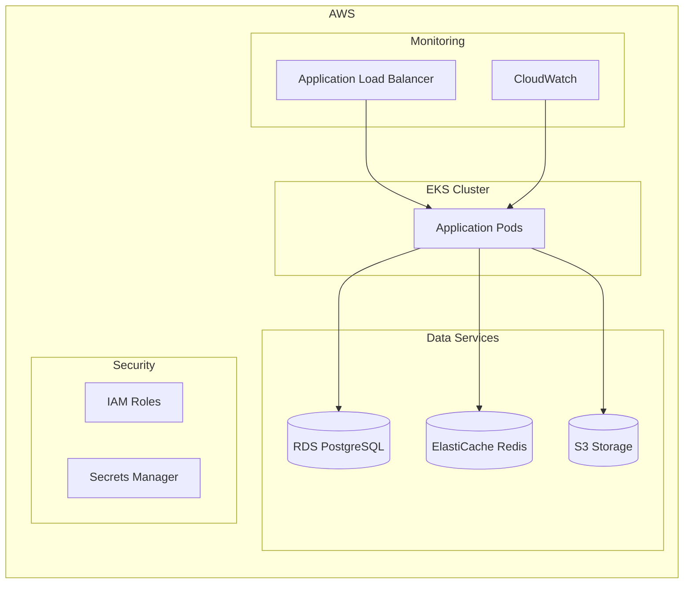
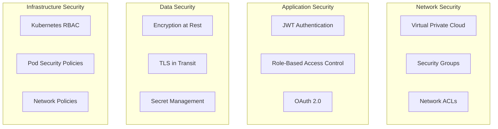
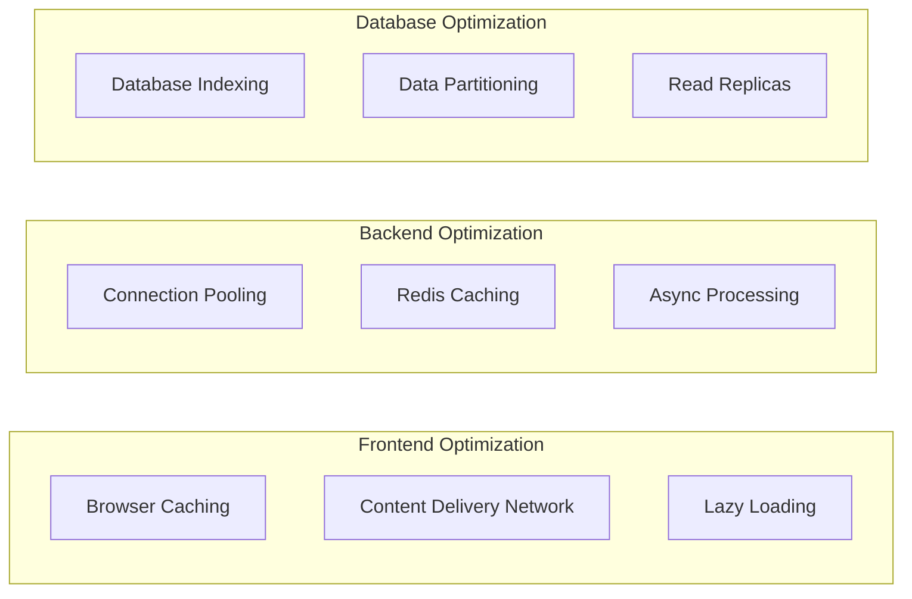

# 🏗️ System Architecture Documentation

## 📋 Table of Contents

1. [Overview](#overview)
2. [High-Level Architecture](#high-level-architecture)
3. [Component Details](#component-details)
4. [Data Flow](#data-flow)
5. [Deployment Architecture](#deployment-architecture)
6. [Security Architecture](#security-architecture)
7. [Scalability Considerations](#scalability-considerations)

---

## 🎯 Overview

The MLOPS ecosystem is designed as a **modular, microservices-based architecture** that supports multiple MLOps use cases. The current implementation focuses on **Project A: Automated Model Performance Degradation Detection** through the MDT Dashboard, with a foundation that can be extended for all other projects.

### 🎨 Design Principles

- **Microservices**: Loosely coupled, independently deployable services
- **Event-Driven**: Asynchronous communication using message queues
- **Cloud-Native**: Container-first with Kubernetes orchestration
- **Observability**: Comprehensive monitoring and logging
- **Security**: Zero-trust security model with end-to-end encryption

---

## 🏗️ High-Level Architecture



### 🔧 Component Architecture



---

## 🔧 Component Details

### 🎨 Frontend Layer

#### Streamlit Dashboard
- **Purpose**: Interactive web interface for model monitoring
- **Technology**: Python, Streamlit, Plotly
- **Features**:
  - Real-time model performance dashboards
  - Drift detection visualizations
  - Model comparison tools
  - Prediction playground
  - Alert management interface

```python
# Key Components
- src/mdt_dashboard/dashboard/main.py          # Main dashboard application
- src/mdt_dashboard/dashboard/components/      # Reusable UI components
- src/mdt_dashboard/plotting.py               # Visualization utilities
```

### 🚀 Backend Layer

#### FastAPI Application
- **Purpose**: RESTful API for all backend operations
- **Technology**: Python, FastAPI, SQLAlchemy
- **Features**:
  - Model CRUD operations
  - Prediction endpoints
  - Drift detection APIs
  - Metrics collection
  - Authentication & authorization

```python
# Key Components
- src/mdt_dashboard/api/main.py               # API application
- src/mdt_dashboard/api/routers/              # API route handlers
- src/mdt_dashboard/core/models.py            # Database models
- src/mdt_dashboard/core/config.py            # Configuration management
```

#### Celery Workers
- **Purpose**: Background task processing
- **Technology**: Python, Celery, Redis
- **Features**:
  - Model training and retraining
  - Drift detection computations
  - Data quality checks
  - Report generation
  - Alert notifications

```python
# Key Components
- src/mdt_dashboard/worker.py                 # Celery worker definitions
- src/mdt_dashboard/ml_pipeline/pipeline.py  # ML pipeline tasks
- src/mdt_dashboard/drift_detection/         # Drift detection algorithms
```

### 💾 Data Layer

#### PostgreSQL Database
- **Purpose**: Primary data store for structured data
- **Schema**:
  - `models`: Model metadata and versions
  - `predictions`: Model predictions and actuals
  - `metrics`: Performance metrics
  - `alerts`: Alert configurations and history
  - `users`: User management

#### Redis Cache
- **Purpose**: Caching and message broker
- **Usage**:
  - API response caching
  - Session storage
  - Celery message broker
  - Real-time data caching

#### InfluxDB (Optional)
- **Purpose**: Time-series metrics storage
- **Usage**:
  - High-frequency metrics
  - Real-time monitoring data
  - Performance analytics

### 🤖 ML Layer

#### MLflow Integration
- **Purpose**: Model lifecycle management
- **Features**:
  - Model registry
  - Experiment tracking
  - Model versioning
  - Artifact storage

#### Drift Detection Engine
- **Purpose**: Automated drift detection
- **Algorithms**:
  - Kolmogorov-Smirnov test
  - Population Stability Index (PSI)
  - Jensen-Shannon Distance
  - Chi-square test
  - Custom statistical tests

---

## 🌊 Data Flow

### 📊 Model Monitoring Flow



### 🔄 Model Training Flow



### 📈 Prediction Flow



---

## 🚀 Deployment Architecture

### 🐳 Docker Containerization

```yaml
# docker-compose.yml structure
services:
  mdt-dashboard:     # Streamlit frontend
  mdt-api:          # FastAPI backend
  mdt-worker:       # Celery workers
  mdt-scheduler:    # Task scheduler
  postgres:         # PostgreSQL database
  redis:            # Redis cache/broker
  mlflow:           # MLflow server
  prometheus:       # Metrics collection
  grafana:          # Monitoring dashboards
```

### ☸️ Kubernetes Deployment



### ☁️ Cloud Architecture

#### AWS Deployment


---

## 🔐 Security Architecture

### 🛡️ Security Layers



### 🔑 Authentication & Authorization

- **JWT Tokens**: Stateless authentication
- **OAuth 2.0**: Third-party integration
- **RBAC**: Role-based permissions
- **API Keys**: Service-to-service auth

### 🔒 Data Protection

- **Encryption at Rest**: AES-256 for databases
- **Encryption in Transit**: TLS 1.3 for all communications
- **Secret Management**: HashiCorp Vault or cloud KMS
- **Data Masking**: PII protection in logs

---

## 📈 Scalability Considerations

### 🔄 Horizontal Scaling

| Component | Scaling Strategy | Considerations |
|-----------|------------------|----------------|
| **Dashboard** | Load balancer + multiple instances | Stateless design |
| **API** | Auto-scaling based on CPU/memory | Connection pooling |
| **Workers** | Queue-based scaling | Task distribution |
| **Database** | Read replicas + connection pooling | Data partitioning |

### 📊 Performance Optimization



### 📈 Monitoring & Alerting

- **Application Metrics**: Response time, error rate, throughput
- **Infrastructure Metrics**: CPU, memory, disk, network
- **Business Metrics**: Model accuracy, drift detection, SLA compliance
- **Custom Alerts**: Threshold-based and anomaly detection

---

## 🔧 Technology Stack Summary

| Layer | Production | Development | Testing |
|-------|------------|-------------|---------|
| **Frontend** | Streamlit, Plotly | Jupyter, Streamlit | Selenium, PyTest |
| **Backend** | FastAPI, SQLAlchemy | FastAPI, SQLite | PyTest, TestClient |
| **Database** | PostgreSQL, Redis | PostgreSQL, Redis | PyTest fixtures |
| **ML** | Scikit-learn, MLflow | Jupyter, MLflow | ML test frameworks |
| **Deployment** | Kubernetes, Docker | Docker Compose | Local testing |
| **Monitoring** | Prometheus, Grafana | Local monitoring | Mock services |

---

## 📚 Next Steps

1. **Phase 1**: Complete MDT Dashboard implementation
2. **Phase 2**: Implement Project B (Multi-Model Deployment)
3. **Phase 3**: Add Projects C-E (Feature Store, Explainability, Data Quality)
4. **Phase 4**: Implement Projects F-J (Advanced MLOps features)

---

*For detailed implementation guides, see the [Development Documentation](development-guide.md)*
