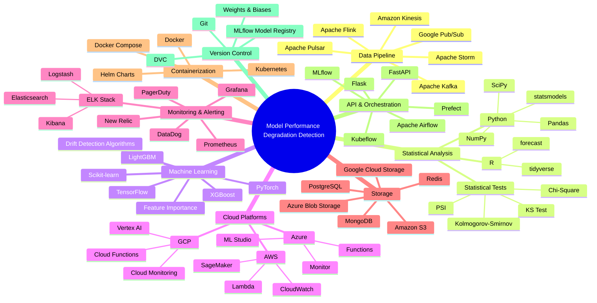

# Automated Model Performance Degradation Detection - Tech Stack Mindmap

```mermaid
mindmap
  root((Model Performance Degradation Detection))
    Data Pipeline
      Apache Kafka
      Apache Pulsar
      Amazon Kinesis
      Google Pub/Sub
      Apache Storm
      Apache Flink
    Statistical Analysis
      Python
        SciPy
        NumPy
        Pandas
        statsmodels
      R
        tidyverse
        forecast
      Statistical Tests
        KS Test
        PSI
        Chi-Square
        Kolmogorov-Smirnov
    Machine Learning
      Scikit-learn
      TensorFlow
      PyTorch
      XGBoost
      LightGBM
      Feature Importance
      Drift Detection Algorithms
    Cloud Platforms
      AWS
        SageMaker
        CloudWatch
        Lambda
      GCP
        Vertex AI
        Cloud Monitoring
        Cloud Functions
      Azure
        ML Studio
        Monitor
        Functions
    Monitoring & Alerting
      Prometheus
      Grafana
      ELK Stack
        Elasticsearch
        Logstash
        Kibana
      DataDog
      New Relic
      PagerDuty
    Storage
      PostgreSQL
      MongoDB
      Redis
      Amazon S3
      Google Cloud Storage
      Azure Blob Storage
    Containerization
      Docker
      Kubernetes
      Docker Compose
      Helm Charts
    API & Orchestration
      FastAPI
      Flask
      Apache Airflow
      Prefect
      Kubeflow
      MLflow
    Version Control
      Git
      DVC
      MLflow Model Registry
      Weights & Biases
```
