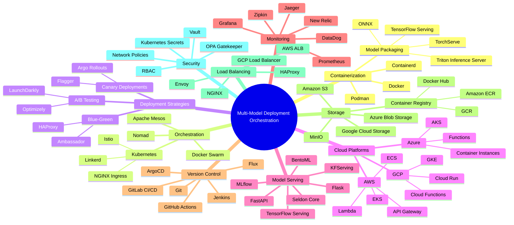

# Multi-Model Deployment Orchestration - Tech Stack Mindmap

```mermaid
mindmap
  root((Multi-Model Deployment Orchestration))
    Containerization
      Docker
      Podman
      Containerd
      Model Packaging
        ONNX
        TensorFlow Serving
        TorchServe
        Triton Inference Server
    Orchestration
      Kubernetes
        Istio
        Linkerd
        NGINX Ingress
      Docker Swarm
      Apache Mesos
      Nomad
    Deployment Strategies
      Canary Deployments
        Flagger
        Argo Rollouts
      Blue-Green
        Ambassador
        HAProxy
      A/B Testing
        Optimizely
        LaunchDarkly
    Cloud Platforms
      AWS
        EKS
        ECS
        Lambda
        API Gateway
      GCP
        GKE
        Cloud Run
        Cloud Functions
      Azure
        AKS
        Container Instances
        Functions
    Model Serving
      KFServing
      Seldon Core
      BentoML
      MLflow
      TensorFlow Serving
      FastAPI
      Flask
    Monitoring
      Prometheus
      Grafana
      Jaeger
      Zipkin
      DataDog
      New Relic
    Version Control
      Git
      GitLab CI/CD
      GitHub Actions
      Jenkins
      ArgoCD
      Flux
    Storage
      Amazon S3
      Google Cloud Storage
      Azure Blob Storage
      MinIO
      Container Registry
        Docker Hub
        Amazon ECR
        GCR
    Load Balancing
      NGINX
      HAProxy
      Envoy
      AWS ALB
      GCP Load Balancer
    Security
      Vault
      Kubernetes Secrets
      RBAC
      Network Policies
      OPA Gatekeeper
```
