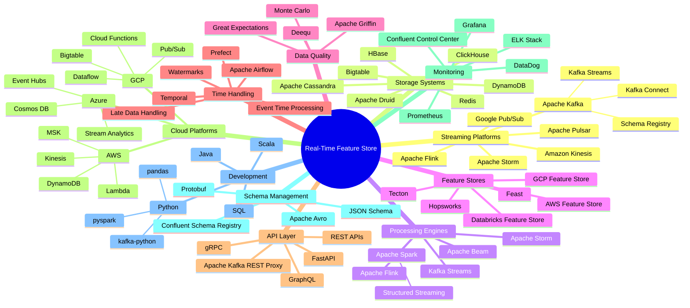

# Real-Time Feature Store for Streaming Data - Tech Stack Mindmap

```mermaid
mindmap
  root((Real-Time Feature Store))
    Streaming Platforms
      Apache Kafka
        Kafka Streams
        Kafka Connect
        Schema Registry
      Apache Pulsar
      Amazon Kinesis
      Google Pub/Sub
      Apache Storm
      Apache Flink
    Storage Systems
      Apache Cassandra
      Redis
      DynamoDB
      Bigtable
      HBase
      ClickHouse
      Apache Druid
    Processing Engines
      Apache Spark
        Structured Streaming
      Apache Flink
      Apache Storm
      Kafka Streams
      Apache Beam
    Feature Stores
      Feast
      Tecton
      Hopsworks
      AWS Feature Store
      GCP Feature Store
      Databricks Feature Store
    Data Quality
      Great Expectations
      Deequ
      Monte Carlo
      Apache Griffin
    Time Handling
      Apache Airflow
      Temporal
      Prefect
      Event Time Processing
      Watermarks
      Late Data Handling
    API Layer
      FastAPI
      gRPC
      GraphQL
      REST APIs
      Apache Kafka REST Proxy
    Cloud Platforms
      AWS
        Kinesis
        DynamoDB
        MSK
        Lambda
      GCP
        Pub/Sub
        Bigtable
        Dataflow
        Cloud Functions
      Azure
        Event Hubs
        Cosmos DB
        Stream Analytics
    Monitoring
      Prometheus
      Grafana
      ELK Stack
      DataDog
      Confluent Control Center
    Schema Management
      Apache Avro
      Protobuf
      JSON Schema
      Confluent Schema Registry
    Development
      Python
        pandas
        pyspark
        kafka-python
      Scala
      Java
      SQL
```
