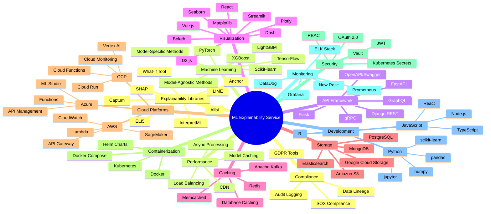

# ML Model Explainability as a Service - Tech Stack Mindmap

```mermaid
mindmap
  root((ML Explainability Service))
    Explainability Libraries
      SHAP
      LIME
      Captum
      InterpretML
      Alibi
      ELI5
      What-If Tool
      Anchor
    Machine Learning
      Scikit-learn
      TensorFlow
      PyTorch
      XGBoost
      LightGBM
      Model-Agnostic Methods
      Model-Specific Methods
    API Framework
      FastAPI
      Flask
      Django REST
      gRPC
      GraphQL
      OpenAPI/Swagger
    Visualization
      Plotly
      D3.js
      Matplotlib
      Seaborn
      Bokeh
      React
      Vue.js
      Streamlit
      Dash
    Caching
      Redis
      Memcached
      Apache Kafka
      Database Caching
    Storage
      PostgreSQL
      MongoDB
      Elasticsearch
      Amazon S3
      Google Cloud Storage
    Cloud Platforms
      AWS
        SageMaker
        Lambda
        API Gateway
        CloudWatch
      GCP
        Vertex AI
        Cloud Functions
        Cloud Run
        Cloud Monitoring
      Azure
        ML Studio
        Functions
        API Management
    Containerization
      Docker
      Kubernetes
      Docker Compose
      Helm Charts
    Security
      OAuth 2.0
      JWT
      RBAC
      Vault
      Kubernetes Secrets
    Monitoring
      Prometheus
      Grafana
      ELK Stack
      DataDog
      New Relic
    Development
      Python
        numpy
        pandas
        scikit-learn
        jupyter
      R
      JavaScript
        Node.js
        React
        TypeScript
    Compliance
      Audit Logging
      Data Lineage
      GDPR Tools
      SOX Compliance
    Performance
      Model Caching
      Async Processing
      Load Balancing
      CDN
```
