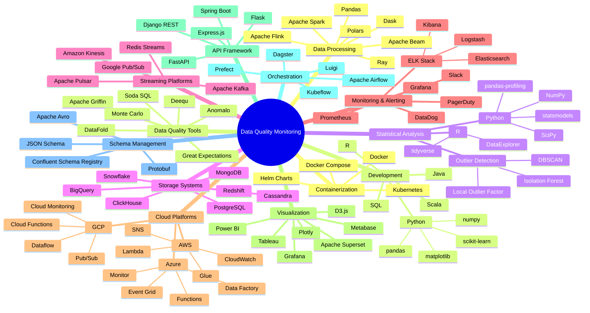

# Automated Data Quality Monitoring - Tech Stack Mindmap

```mermaid
mindmap
  root((Data Quality Monitoring))
    Data Processing
      Apache Spark
      Apache Flink
      Pandas
      Dask
      Ray
      Polars
      Apache Beam
    Data Quality Tools
      Great Expectations
      Deequ
      Apache Griffin
      Soda SQL
      Monte Carlo
      DataFold
      Anomalo
    Statistical Analysis
      Python
        SciPy
        NumPy
        statsmodels
        pandas-profiling
      R
        tidyverse
        DataExplorer
      Outlier Detection
        Isolation Forest
        DBSCAN
        Local Outlier Factor
    Storage Systems
      PostgreSQL
      MongoDB
      Cassandra
      ClickHouse
      BigQuery
      Snowflake
      Redshift
    Streaming Platforms
      Apache Kafka
      Apache Pulsar
      Amazon Kinesis
      Google Pub/Sub
      Redis Streams
    Monitoring & Alerting
      Prometheus
      Grafana
      ELK Stack
        Elasticsearch
        Logstash
        Kibana
      DataDog
      PagerDuty
      Slack
    Cloud Platforms
      AWS
        Glue
        CloudWatch
        SNS
        Lambda
      GCP
        Dataflow
        Cloud Monitoring
        Pub/Sub
        Cloud Functions
      Azure
        Data Factory
        Monitor
        Event Grid
        Functions
    Visualization
      Grafana
      Tableau
      Power BI
      Plotly
      D3.js
      Apache Superset
      Metabase
    API Framework
      FastAPI
      Flask
      Django REST
      Spring Boot
      Express.js
    Orchestration
      Apache Airflow
      Prefect
      Luigi
      Dagster
      Kubeflow
    Schema Management
      Apache Avro
      Protobuf
      JSON Schema
      Confluent Schema Registry
    Containerization
      Docker
      Kubernetes
      Docker Compose
      Helm Charts
    Development
      Python
        pandas
        numpy
        scikit-learn
        matplotlib
      SQL
      Scala
      Java
      R
```
