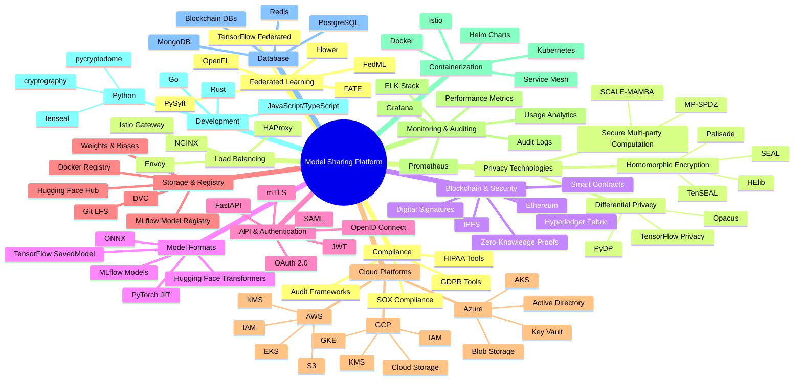

# Cross-Organization Model Sharing Platform - Tech Stack Mindmap

```mermaid
mindmap
  root((Model Sharing Platform))
    Federated Learning
      TensorFlow Federated
      PySyft
      FedML
      FATE
      OpenFL
      Flower
    Privacy Technologies
      Differential Privacy
        TensorFlow Privacy
        Opacus
        PyDP
      Homomorphic Encryption
        SEAL
        HElib
        Palisade
        TenSEAL
      Secure Multi-party Computation
        MP-SPDZ
        SCALE-MAMBA
    Blockchain & Security
      Hyperledger Fabric
      Ethereum
      IPFS
      Smart Contracts
      Digital Signatures
      Zero-Knowledge Proofs
    Model Formats
      ONNX
      TensorFlow SavedModel
      PyTorch JIT
      MLflow Models
      Hugging Face Transformers
    API & Authentication
      FastAPI
      OAuth 2.0
      JWT
      SAML
      OpenID Connect
      mTLS
    Storage & Registry
      Docker Registry
      MLflow Model Registry
      Weights & Biases
      Hugging Face Hub
      DVC
      Git LFS
    Cloud Platforms
      AWS
        EKS
        IAM
        KMS
        S3
      GCP
        GKE
        IAM
        KMS
        Cloud Storage
      Azure
        AKS
        Active Directory
        Key Vault
        Blob Storage
    Monitoring & Auditing
      Prometheus
      Grafana
      ELK Stack
      Audit Logs
      Usage Analytics
      Performance Metrics
    Containerization
      Docker
      Kubernetes
      Istio
      Service Mesh
      Helm Charts
    Development
      Python
        cryptography
        pycryptodome
        tenseal
      Go
      Rust
      JavaScript/TypeScript
    Database
      PostgreSQL
      MongoDB
      Redis
      Blockchain DBs
    Compliance
      GDPR Tools
      SOX Compliance
      HIPAA Tools
      Audit Frameworks
    Load Balancing
      NGINX
      HAProxy
      Envoy
      Istio Gateway
```
