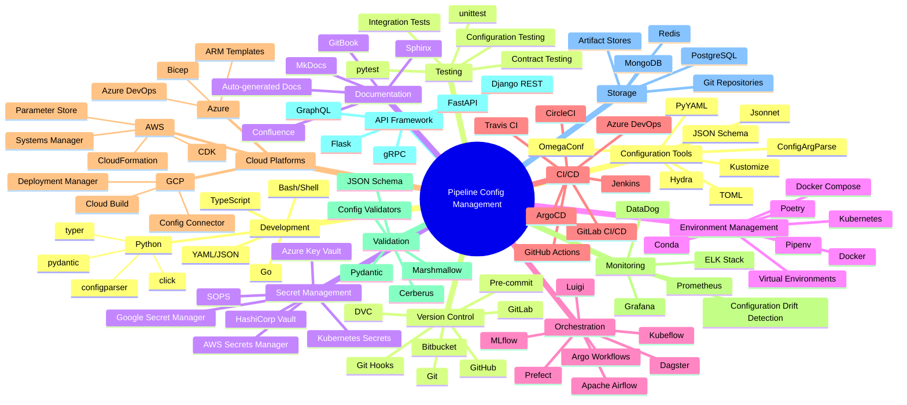

# ML Pipeline Configuration Management - Tech Stack Mindmap

```mermaid
mindmap
  root((Pipeline Config Management))
    Configuration Tools
      Hydra
      OmegaConf
      ConfigArgParse
      PyYAML
      TOML
      JSON Schema
      Jsonnet
      Kustomize
    Version Control
      Git
      GitLab
      GitHub
      Bitbucket
      DVC
      Git Hooks
      Pre-commit
    Secret Management
      HashiCorp Vault
      Kubernetes Secrets
      AWS Secrets Manager
      Azure Key Vault
      Google Secret Manager
      SOPS
    Environment Management
      Docker
      Kubernetes
      Conda
      Poetry
      Pipenv
      Virtual Environments
      Docker Compose
    Orchestration
      Apache Airflow
      Prefect
      Kubeflow
      MLflow
      Dagster
      Luigi
      Argo Workflows
    CI/CD
      Jenkins
      GitLab CI/CD
      GitHub Actions
      Azure DevOps
      CircleCI
      Travis CI
      ArgoCD
    Cloud Platforms
      AWS
        Parameter Store
        Systems Manager
        CloudFormation
        CDK
      GCP
        Cloud Build
        Deployment Manager
        Config Connector
      Azure
        ARM Templates
        Bicep
        Azure DevOps
    Monitoring
      Prometheus
      Grafana
      ELK Stack
      DataDog
      Configuration Drift Detection
    Validation
      JSON Schema
      Cerberus
      Marshmallow
      Pydantic
      Config Validators
    API Framework
      FastAPI
      Flask
      Django REST
      gRPC
      GraphQL
    Storage
      PostgreSQL
      MongoDB
      Redis
      Git Repositories
      Artifact Stores
    Development
      Python
        pydantic
        click
        typer
        configparser
      YAML/JSON
      Bash/Shell
      Go
      TypeScript
    Testing
      pytest
      unittest
      Configuration Testing
      Integration Tests
      Contract Testing
    Documentation
      Sphinx
      MkDocs
      GitBook
      Confluence
      Auto-generated Docs
```
