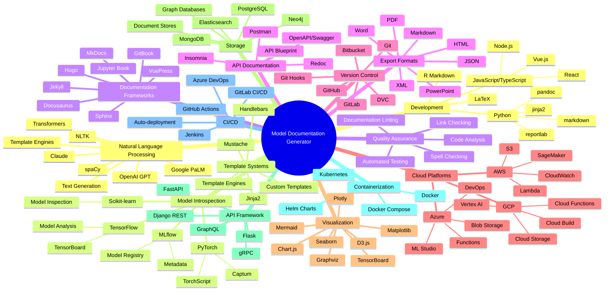

# Automated Model Documentation Generator - Tech Stack Mindmap

```mermaid
mindmap
  root((Model Documentation Generator))
    Natural Language Processing
      spaCy
      NLTK
      Transformers
      OpenAI GPT
      Google PaLM
      Claude
      Text Generation
      Template Engines
    Model Introspection
      TensorFlow
        Model Analysis
        TensorBoard
      PyTorch
        TorchScript
        Captum
      Scikit-learn
        Model Inspection
      MLflow
        Model Registry
        Metadata
    Documentation Frameworks
      Sphinx
      MkDocs
      GitBook
      Docusaurus
      VuePress
      Hugo
      Jekyll
      Jupyter Book
    API Documentation
      OpenAPI/Swagger
      Redoc
      Postman
      Insomnia
      API Blueprint
    Version Control
      Git
      GitLab
      GitHub
      Bitbucket
      Git Hooks
      DVC
    Cloud Platforms
      AWS
        SageMaker
        Lambda
        S3
        CloudWatch
      GCP
        Vertex AI
        Cloud Functions
        Cloud Storage
        Cloud Build
      Azure
        ML Studio
        Functions
        Blob Storage
        DevOps
    Visualization
      Plotly
      Matplotlib
      Seaborn
      D3.js
      Chart.js
      Mermaid
      Graphviz
      TensorBoard
    Storage
      PostgreSQL
      MongoDB
      Elasticsearch
      Neo4j
      Graph Databases
      Document Stores
    API Framework
      FastAPI
      Flask
      Django REST
      GraphQL
      gRPC
    Containerization
      Docker
      Kubernetes
      Docker Compose
      Helm Charts
    CI/CD
      Jenkins
      GitLab CI/CD
      GitHub Actions
      Azure DevOps
      Auto-deployment
    Development
      Python
        jinja2
        markdown
        pandoc
        reportlab
      JavaScript/TypeScript
        React
        Vue.js
        Node.js
      R Markdown
      LaTeX
    Template Systems
      Jinja2
      Handlebars
      Mustache
      Template Engines
      Custom Templates
    Quality Assurance
      Code Analysis
      Documentation Linting
      Automated Testing
      Link Checking
      Spell Checking
    Export Formats
      PDF
      HTML
      Markdown
      Word
      PowerPoint
      JSON
      XML
```
