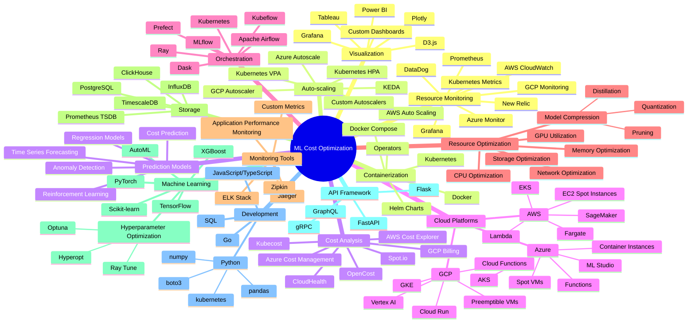

# ML Model Cost Optimization System - Tech Stack Mindmap

```mermaid
mindmap
  root((ML Cost Optimization))
    Resource Monitoring
      Prometheus
      Grafana
      DataDog
      New Relic
      AWS CloudWatch
      GCP Monitoring
      Azure Monitor
      Kubernetes Metrics
    Auto-scaling
      Kubernetes HPA
      Kubernetes VPA
      KEDA
      AWS Auto Scaling
      GCP Autoscaler
      Azure Autoscale
      Custom Autoscalers
    Cost Analysis
      AWS Cost Explorer
      GCP Billing
      Azure Cost Management
      Kubecost
      OpenCost
      CloudHealth
      Spot.io
    Cloud Platforms
      AWS
        EC2 Spot Instances
        Lambda
        Fargate
        SageMaker
        EKS
      GCP
        Preemptible VMs
        Cloud Functions
        Cloud Run
        Vertex AI
        GKE
      Azure
        Spot VMs
        Functions
        Container Instances
        ML Studio
        AKS
    Orchestration
      Kubernetes
      Apache Airflow
      Kubeflow
      MLflow
      Ray
      Dask
      Prefect
    Resource Optimization
      CPU Optimization
      Memory Optimization
      GPU Utilization
      Storage Optimization
      Network Optimization
      Model Compression
        Quantization
        Pruning
        Distillation
    Monitoring Tools
      ELK Stack
      Jaeger
      Zipkin
      Application Performance Monitoring
      Custom Metrics
    Storage
      PostgreSQL
      InfluxDB
      TimescaleDB
      Prometheus TSDB
      ClickHouse
    Machine Learning
      Scikit-learn
      TensorFlow
      PyTorch
      XGBoost
      AutoML
      Hyperparameter Optimization
        Optuna
        Ray Tune
        Hyperopt
    API Framework
      FastAPI
      Flask
      gRPC
      GraphQL
    Development
      Python
        pandas
        numpy
        boto3
        kubernetes
      Go
      JavaScript/TypeScript
      SQL
    Visualization
      Grafana
      Plotly
      D3.js
      Tableau
      Power BI
      Custom Dashboards
    Containerization
      Docker
      Kubernetes
      Docker Compose
      Helm Charts
      Operators
    Prediction Models
      Time Series Forecasting
      Regression Models
      Anomaly Detection
      Reinforcement Learning
      Cost Prediction
```
