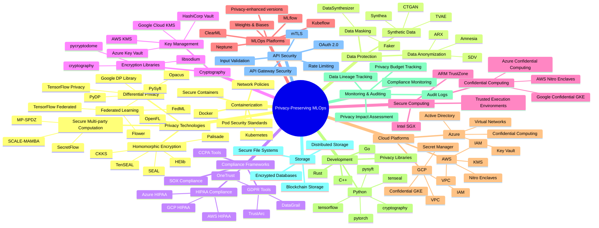

# Privacy-Preserving ML Operations - Tech Stack Mindmap

```mermaid
mindmap
  root((Privacy-Preserving MLOps))
    Privacy Technologies
      Differential Privacy
        TensorFlow Privacy
        Opacus
        PyDP
        Google DP Library
      Homomorphic Encryption
        SEAL
        HElib
        Palisade
        TenSEAL
        CKKS
      Secure Multi-party Computation
        MP-SPDZ
        SCALE-MAMBA
        SecretFlow
      Federated Learning
        TensorFlow Federated
        PySyft
        FedML
        Flower
        OpenFL
    Data Protection
      Data Anonymization
        ARX
        Amnesia
        SDV
      Data Masking
        Faker
        DataSynthesizer
      Synthetic Data
        CTGAN
        TVAE
        Synthea
    Compliance Frameworks
      GDPR Tools
        OneTrust
        TrustArc
        DataGrail
      HIPAA Compliance
        AWS HIPAA
        GCP HIPAA
        Azure HIPAA
      SOX Compliance
      CCPA Tools
    Cryptography
      Encryption Libraries
        cryptography
        pycryptodome
        libsodium
      Key Management
        HashiCorp Vault
        AWS KMS
        Azure Key Vault
        Google Cloud KMS
    Secure Computing
      Intel SGX
      ARM TrustZone
      Trusted Execution Environments
      Confidential Computing
        Azure Confidential Computing
        Google Confidential GKE
        AWS Nitro Enclaves
    MLOps Platforms
      MLflow
      Kubeflow
      Weights & Biases
      Neptune
      ClearML
      Privacy-enhanced versions
    Cloud Platforms
      AWS
        Nitro Enclaves
        KMS
        IAM
        VPC
      GCP
        Confidential GKE
        Secret Manager
        IAM
        VPC
      Azure
        Confidential Computing
        Key Vault
        Active Directory
        Virtual Networks
    Development
      Python
        cryptography
        tenseal
        pysyft
        pytorch
        tensorflow
      C++
      Rust
      Go
      Privacy Libraries
    Monitoring & Auditing
      Privacy Budget Tracking
      Compliance Monitoring
      Audit Logs
      Privacy Impact Assessment
      Data Lineage Tracking
    Storage
      Encrypted Databases
      Secure File Systems
      Blockchain Storage
      Distributed Storage
    API Security
      OAuth 2.0
      mTLS
      API Gateway Security
      Rate Limiting
      Input Validation
    Containerization
      Docker
      Kubernetes
      Secure Containers
      Pod Security Standards
      Network Policies
```
